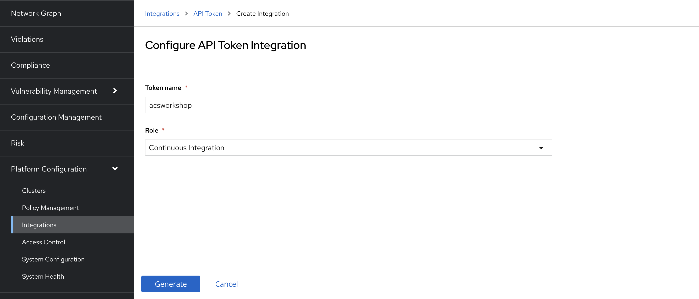
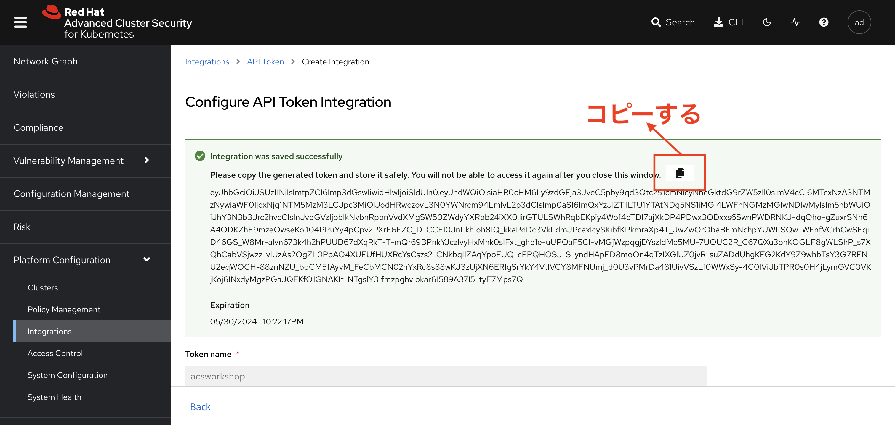
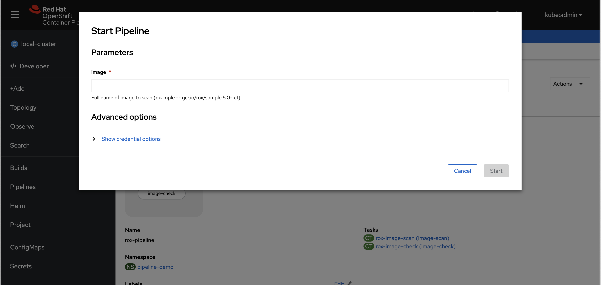
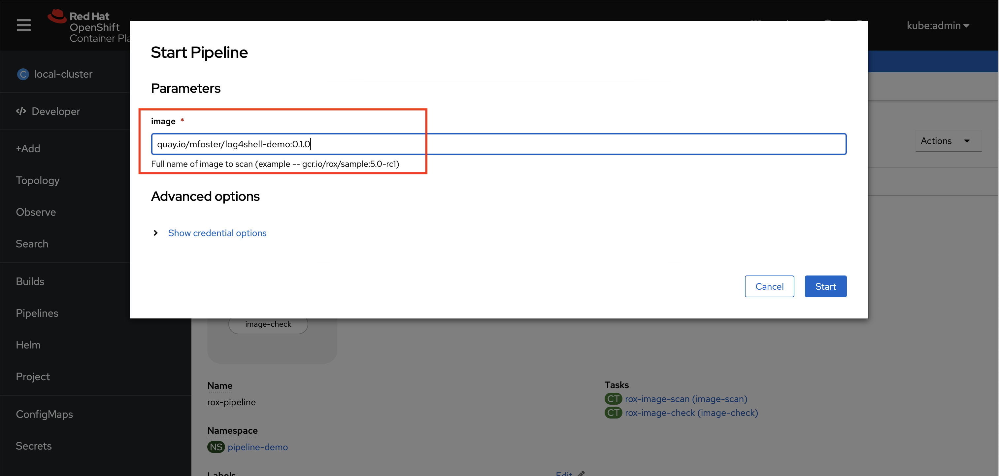

= Red Hat Advanced Cluster SecurityによるDevSecOpsとポリシーエンフォースメント

== OpenShift Pipelinesを使ってRed Hat Advanced Cluster Security for Kubernetesを自動化する

=== はじめに

本ワークショップでは、TektonオープンソースプロジェクトをベースとしたOpenShift Pipelinesを使用して、より包括的な継続的インテグレーションソリューションの一部としてRed Hat Advanced Cluster Security for Kubernetesの実行を自動化する方法を説明します。その目的は、Kubernetesリソースの検証を継続的インテグレーションプロセスに導入し、定義されたポリシーに対する違反があれば、開発ライフサイクルの早い段階で対処できるようにすることにあります。

== パイプラインの要件と必要な機能

=== RHACSコマンドラインインターフェース

Red Hat Advanced Cluster Security for Kubernetesには、RHACSサーバーに保持されているポリシー定義に対してイメージやリソースを評価するためのコマンドラインインターフェイス *roxctl* があります。コマンドラインインターフェイスは、アドホックに使用するためにRHACSウェブユーザーインターフェイスからダウンロードすることができ、ここで紹介する自動化ステップでは、分析の各実行中にRHACSサーバーからroxctlがダウンロードされます。これにより、サーバーと一致する正しいバージョンが常に使用されることが保証されます。


=== roxctl 分析オプション

roxctlコマンドラインインターフェイスには、リソースやイメージの解析のためのオプションがいくつか用意されています。特に注目しているのはdeploymentオプションで、従来はKubernetesリソースのデプロイ準備状況を確認するために使用されていました。開発のビルド段階でこのオプションを使用することで、チームはデプロイ時期まで待つのではなく、より早い段階でデプロイの問題を把握することができます。これにより、チームは開発中に問題を修正することができ、コストを削減し、よりスムーズなデプロイメントにつなげることができます。

== （↓ここから）本ワークショップの範囲外です

|===
*NOTE:* roxctl deployment checkを利用するPipelineについて記載しています。本ワークショップでは演習外なので、参考程度に読み飛ばしてください。
|===

=== 継続的インテグレーションとroxctlプロセス
以下の例のCIプロセスは、ユーザーが独自の広範囲のOpenShift Pipelinesプロセスに構築できるタスク、スケルトンパイプライン、およびパイプライン実行リソースを利用しています。リソースとそれらの相互作用を図 1 に示します。

image::images/tekton-1.png[]

_図 1: OpenShift Pipeline process_ +

=== Pipeline Run リソース

OpenShift Pipelines の "pipeline run" リソースは、必要なパラメータを渡して、パイプラインリソースを呼び出します。パラメータの一部は上の図1で強調表示されており、すべてのパラメータは下の表で説明されています。パイプラインの実行では、"files"という10MBの永続的なボリュームにワークスペースを定義し、そこにソースアセットをクローンし、結果ファイルが書き込まれます。ここで説明するタスクを既存のOpenShift Pipelinesプロセスに追加したい場合は、パラメータ定義とワークスペース・ボリュームを既存のPipeline Runに追加してください。

|===
|Parameter|Description|Used by task

|acs_central_endpoint|RHACS セントラルサーバーの URL を含むシークレットの名前です。|Resource deployment check

|acs_api_token|RHACS Web ユーザーインターフェース内で生成されたアクセストークンを含むシークレットの名前です。 https://help-internal.stackrox.com/docs/integrate-with-other-tools/integrate-with-ci-systems/#configure-access[ここ] で説明されている、継続的インテグレーションアクセストークンです。|Resource deployment check

|上記2つのパラメータは、両方のデータ項目を含む1つのシークレットを参照することができます。||

|git-url|検証対象のリソースを含む GitHub リポジトリの URL です。|Git clone workspace

|git-revision|コンテンツをチェックアウトするために使用する識別子。(branch、tag、sha、ref...)|Git clone workspace

|file-location-in-git-repo|検査するリソースを含むディレクトリ。|Resource deployment check

|recursive-search|`true` の場合、上記のパスは、拡張子がyamlまたはymlのすべてのファイルに対して再帰的に検索されます。|Resource deployment check
|===

=== Pipeline リソース

前述のGitHubリポジトリにあるOpenShift Pipelinesの"pipeline"リソースが、タスクの実行とタスク間のパラメータの受け渡しをオーケストレーションしています。パイプラインの使い方については、「スキャン結果に基づく意思決定」の項で詳しく解説しています。

== （↑ここまで）

== ワークショップセットアップ

本ワークショップでは、コマンドラインインターフェイス *roxctl* を利用する簡単なPipelineを作成して、継続的インテグレーションプロセスに導入した場合の動作を確認します。

=== Pipelineアセットをデプロイする

以下に説明するアセットは、GitHubの公開リポジトリ https://github.com/mfosterrox/demo.git で入手できます。アセットをデプロイするには、以下を実行します。

|===
*NOTE* 既存のフォルダーの準備ができている場合は *git clone* コマンドをスキップしますが、すべてのリソースが利用可能であることを確認するためにその後のコマンドを実行する必要があります。
|===

[source,bash,role="execute"]
----
git clone https://github.com/openshiftdemos/openshift-ops-workshops acs-workshop
----

[source,bash,role="execute"]
----
export TUTORIAL_HOME="$(pwd)/acs-workshop"
kubectl apply -f $TUTORIAL_HOME/workshop/demo-apps/configuration --recursive
kubectl apply -f $TUTORIAL_HOME/workshop/demo-apps/ --recursive
----

|===
*NOTE* このコマンドは、環境にたくさんの数のマニフェストを適用します。
|===

次のコマンドを実行し、アプリケーションが稼働していることを確認します。

[source,bash,role="execute"]
----
kubectl get deployments -l demo=acs -A
----

*出力* は以下のようになります。

```bash
NAMESPACE      NAME               READY   UP-TO-DATE   AVAILABLE   AGE
backend        api-server         1/1     1            1           0d
frontend       asset-cache        1/1     1            1           0d
log4shell      log4shell-app      3/3     3            3           0d
medical        reporting          1/1     1            1           0d
operations     jump-host          1/1     1            1           0d
payments       visa-processor     1/1     1            1           0d
spring4shell   spring4shell-app   3/3     3            3           0d
```
=== TaskとPipeline

Pipelineアセットをデプロイした際に、次のyamlファイルを利用してTaskとPipelineがデプロイされています。

$TUTORIAL_HOME/workshop/demo-apps/pipelines/pipeline以下

* rox-pipeline.yml
* rox-secrets.yml

$TUTORIAL_HOME/workshop/demo-apps/pipelines/tasks以下

* rox-image-check-task.yml
* rox-image-scan-task.yml

*rox-pipeline* Pipelineは2つのTaskから構成されています。

==== Image Scan Pod Task

*rox-pipeline* Pipelineを構成する2つのTaskのうち、最初のTaskは *image scan test* Taskです。このTaskは、まず、スキャンするイメージをユーザに要求します。次に、roxctl CLI はこの情報をCentralに送信し、分析を依頼します。ACS Centralは、イメージに関連する修正可能な脆弱性と修正不可能な脆弱性をすべて送り返します。

*image scan* Taskの内容を表示するには、コマンドラインで以下のcatコマンドを実行します。ファイルには、必要な変数、スキャンを完了するために必要な手順、およびスクリプトそのものが表示されます。

[source,bash,role="execute"]
----
cat $TUTORIAL_HOME/workshop/demo-apps/pipelines/tasks/rox-image-scan-task.yml 
----

スキャンが完了したら、コンテナが特定のポリシーに違反していないかどうかをチェックします。

==== Image Check Test Task

*image check test* Taskは、ACSで有効になっているポリシーとスキャンしたイメージを照合するようACS Centralに指示します。 *image scan test* Taskと非常によく似ており、主な違いはroxctlコマンドです。

*image check* Taskの内容を表示するには、コマンドラインで以下のcatコマンドを実行します。

[source,bash,role="execute"]
----
cat $TUTORIAL_HOME/workshop/demo-apps/pipelines/tasks/rox-image-check-task.yml 
----

rox-image-scan-task.ymlとrox-image-check-task.ymlともにエンドポイント *ROX_CENTRAL_ENDPOINT* と APIトークン *ROX_API_TOKEN* の2つの変数が欠落しています。Pipelineとクラスタが外部から侵入されないように、自動チェックには正しいアクセス権を与える必要があります。そのため、これらの情報はsecretに保存します。

次のステップでは、これらのコマンドを実行できるように、Pipelineにアクセス権を付与します。

=== CIプロセスの権限付与

まず、ACS Centralにアクセスするためのトークンを作成する必要があります。

RHACSのWebユーザーインターフェースにアクセスし、左側のメニューから"Platform Configuration"を選択し、"integrations"を選択します。一番下の"Authentication Tokens"のセクションまでスクロールし、"StackRox API Token"を選択します。

image::images/ci-1.png[]

右上の *Generate Token* ボタンを押し、トークンに適切な名前を付け（例えばacsworkshop）、"Continuous Integration "というRoleを選択し、*Generate* ボタンを押します。



* トークンが生成されるので、必ずコピーしてください。次のステップで必要になります。トークンの表示は一度きりで、再度表示することはできません。 



* 次に、*$TUTORIAL_HOME/workshop/demo-apps/pipelines/pipeline/rox-secrets-mad.yml* ファイルを編集してください。vi/vim/nano/などお好みのコマンドラインエディタを使用して、先ほどコピーしたトークンを追加してください。

*NOTE* : *rox_api_token: "YOUR_API_TOKEN_HERE"* という行の *YOUR_API_TOKEN_HERE* の部分をコピーしたトークンと置き換えます。


その後、次のコマンドで変更内容をOpenShift環境に適用します。

[source,bash,role="execute"]
----
kubectl apply -f $TUTORIAL_HOME/workshop/demo-apps/pipelines/pipeline/rox-secrets-mad.yml
----

|===
*NOTE* : テキストエディタに不慣れな方は、OpenShiftコンソールから編集することもできます。Workloads -> Secretsに行き、'roxsecrets'をクリックし、YAMLタブに切り替えてそこで変更を加え、保存します。
|===

これで、*rox-pipeline* Pipelineを実行する準備が整いました。

== Pipelineの実行

*rox-pipeline* Pipelineを実行するために、まず、OpenShiftのコンソールのAdministratorパースペクティブで、プロジェクト *pipeline-demo* に移動します。プロジェクトを移動したら、左側のメニューから *Pipelines* タブをクリックして、*Pipelines* ドロップダウンを選択します。

image::images/pipeline-1.png[]

*rox-pipeline* と書かれたPipelineが表示されているはずです。

Pipelineを実行してみましょう。Pipelineを実行するには以下のいずれかの操作を行います。

* Pipelineの左にある3つの点をクリックして *start* をクリックする
* *rox-pipeline* をクリックして詳細ページに移動して、*actions -> start* を選択する

image::images/pipeline-2.png[]

または

image::images/pipeline-3.png[]

* スキャンしたいイメージが要求されます。このワークショップではlog4shellの脆弱性があることが分かっているイメージ（quay.io/mfoster/log4shell-demo:0.1.0）を調べます。





* イメージ名を入力後、右下の *start* をクリックし、Pipelineが実行段階にあることを確認します。下の図のような状態になるはずです。

image::images/pipeline-5.png[]

image::images/pipeline-6.png[]

このイメージは失敗するように設計されているので、しばらくすると、Taskのうち1つだけが通過し、1つはFailします。したがって、結果は次のようになります。

image::images/pipeline-7.png[]

PLRというアイコンの横のrox-pipeline-xxx(xxxは環境に依存)をクリックします。

image::images/pipeline-8.png[]

Log snippet欄のログの抜粋から、6つのポリシー違反があることがわかります。

* 抜粋だけでなくPipelineの総出力を見るには、*Logs* タブをクリックします。

ログを展開すると、以下のような出力が得られます。

image::images/pipeline-9.png[]

ログには、log4shellポリシー(Fixable Severity at least Important)に違反したためPipelineを切断したことが示されています。

この結果からわかるように、このチェックが他のビルド/デプロイPipelineに追加された場合、脆弱なアプリのデプロイを前倒しで停止させることが可能です。

以上で、演習は終了です。
