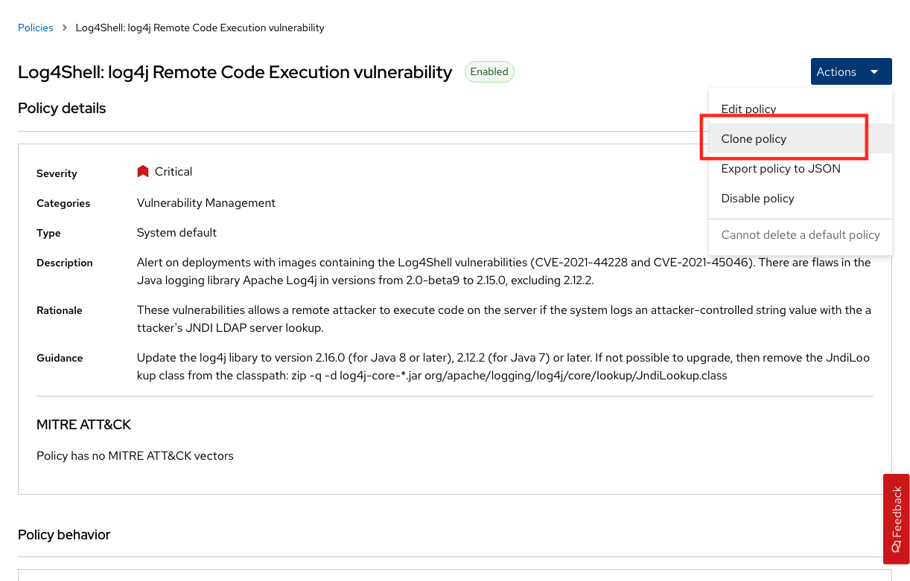
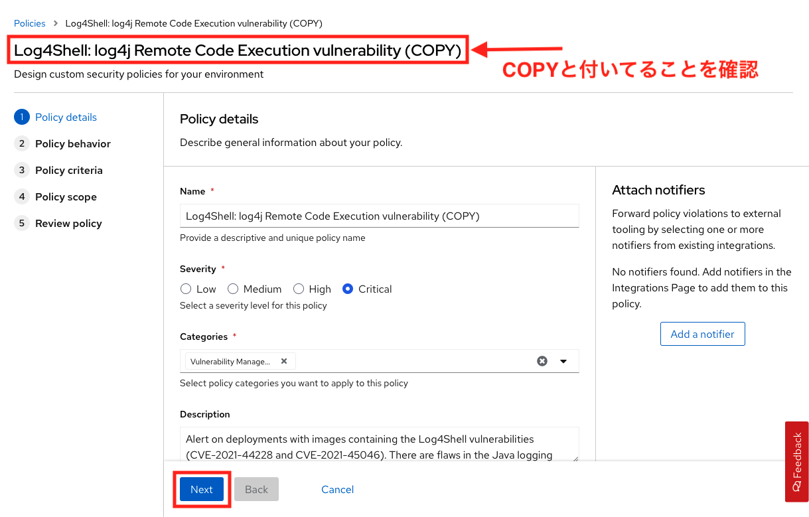
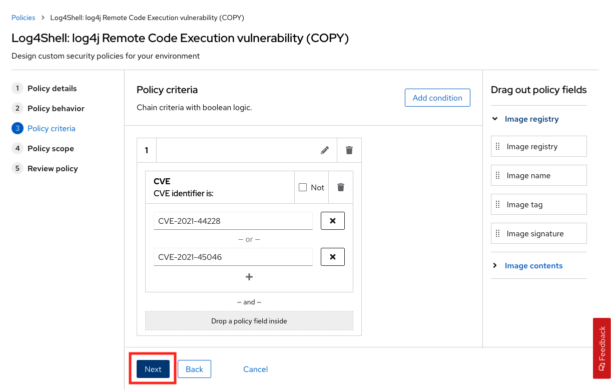
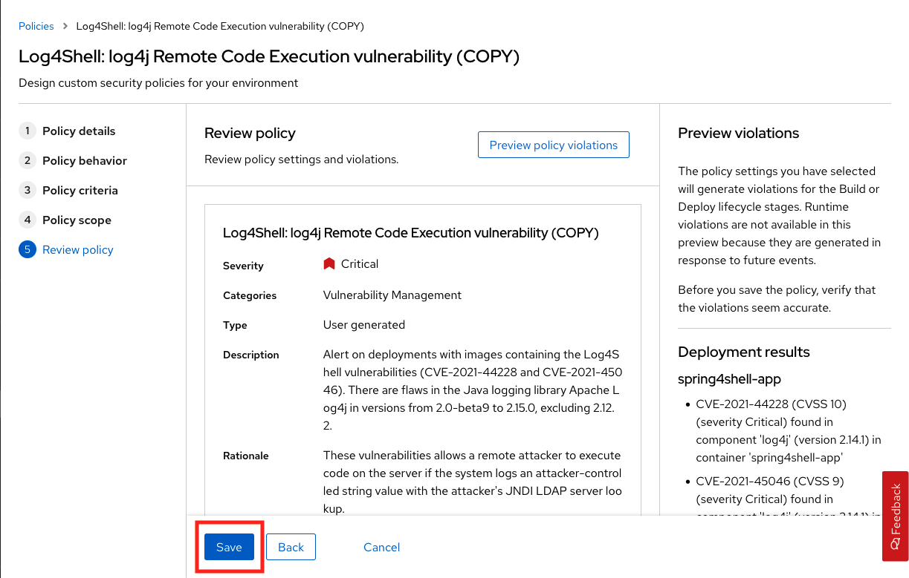
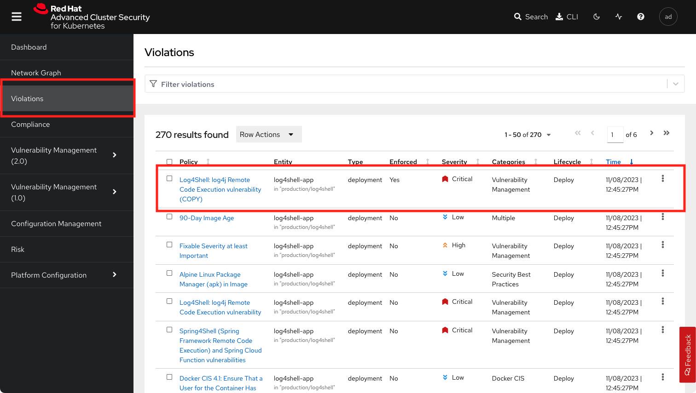
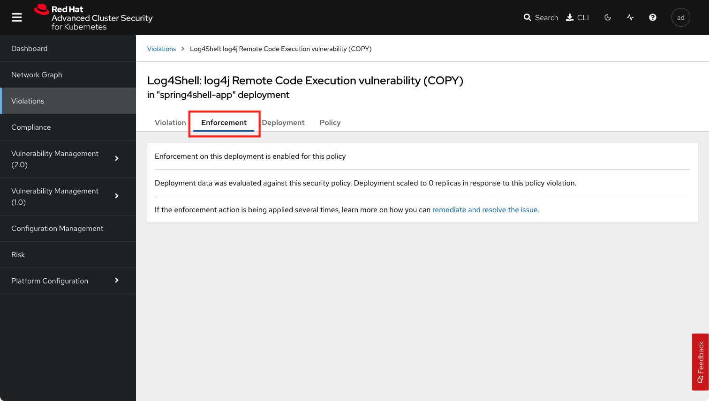
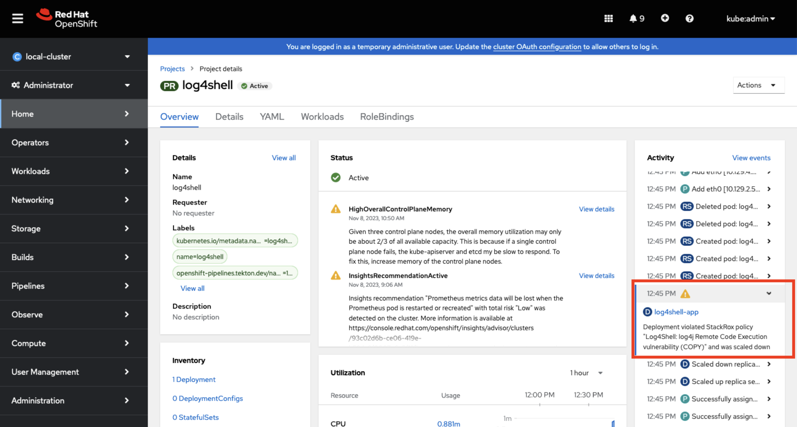
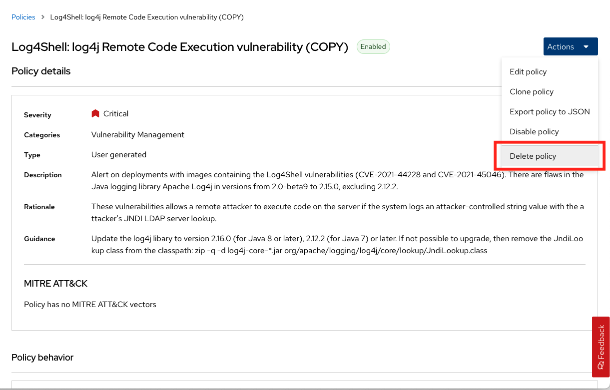

= Red Hat Advanced Cluster SecurityによるKubernetesの脆弱性管理

== ワークショップの目的

このセッションは、ACSダッシュボードを使用してKubernetesの脆弱性を特定することに慣れることを目的としています。特定の脆弱性の特徴や、Kubernetesクラスタで効果的に制御を実装する方法について説明します。

このワークショップでは、log4shellのエクスポートに焦点を当てます。このユースケースでは、複数のアプリケーションが展開されます。最後に時間があれば、あなたのユースケースに役立つかもしれない、より多くのセキュリティ機能を見つけられるかどうか、インターフェイスを探索してください。

== Red Hat Advanced Cluster Security for Kubernetes の基本

Red Hat Advanced Cluster Security for Kubernetes (Red Hat Advanced Cluster Security または略して ACS) は、Kubernetes 上でのクラウドネイティブ開発アプローチのセキュリティーのニーズに対応するためのツールと機能を提供します。

ACS ソリューションは、監査、ネットワーク・セグメンテーションの認識と構成、セキュリティ・リスクのプロファイリング、セキュリティ関連の構成管理、脅威の検出、インシデント対応を通じて、クラスタのセキュリティ、脆弱性管理、セキュリティ・コンプライアンスの可視性を提供します。さらに、ACSはAPIを通じて、ツールからのアクションをアプリケーションコード開発プロセスに組み込むことができます。

これらのセキュリティ機能は、複数のデータセンター、プライベートクラウド、Kubernetesクラスタを実行するパブリッククラウドなど、さまざまな環境にわたって作業する開発者や管理者の主要な作業となります。

=== ACS の機能

Red Hat Advanced Cluster Security for Kubernetes を使用すると、以下のユースケースを含む包括的な Kubernetes セキュリティを獲得することができます。

* 可視性：イメージ、レジストリ、コンテナ、デプロイメント、およびランタイムの動作の全体像を確認できます。
* 脆弱性管理：ソフトウェア開発ライフサイクル全体にわたって、コンテナイメージとKubernetesの脆弱性を特定し、修正します。
* コンプライアンス：インタラクティブなダッシュボードとワンクリックの監査レポートにより、CISベンチマーク、NIST、PCI、HIPAAに対するシステムの監査を行うことができます。
* ネットワーク・セグメンテーション：既存の接続を可視化し、Kubernetesネイティブの制御を使用してより厳密なセグメンテーションを実施し、影響範囲を縮小します。
* リスクプロファイリング：Kubernetesの宣言型データのコンテキストを使用して、すべてのデプロイメントをリスクレベルごとにランク付けし、修復の優先順位付けを行います。
* 構成管理：DockerとKubernetesのベストプラクティスを適用して、環境を強化し、より安全で安定したアプリケーションを実現します。
* 脅威の検出：ルール、自動化された許可リスト、およびベースラインを使用して、実行中のアプリケーションの疑わしいアクティビティを正確に特定します。

=== ACSのアーキテクチャ

ACS Platformは、KubernetesまたはOpenShiftクラスターにPodのセットとしてインストールされ、以下のコンポーネントが含まれます。

image::images/acs-2.png[]

* https://docs.openshift.com/acs/architecture/acs-architecture.html#centralized-components_acs-architecture[Central]: [Centralized components] Centralは、Red Hat Advanced Cluster Security for Kubernetesのメインコンポーネントで、Kubernetesのデプロイメントとしてインストールされます。データの永続化、APIインタラクション、ユーザーインターフェース (ポータル) アクセスを処理します。同じCentralインスタンスを使用して、複数のOpenShift Container PlatformまたはKubernetesクラスタを保護することができます。

* https://docs.openshift.com/acs/architecture/acs-architecture.html#centralized-components_acs-architecture[Scanner]: [Centralized component] Red Hat Advanced Cluster Security for Kubernetes には、Scanner と呼ばれるイメージ脆弱性スキャンコンポーネントが含まれています。これは、すべてのイメージレイヤーを分析し、CVE (Common Vulnerabilities and Exposures) リストから既知の脆弱性をチェックします。また、Scannerは、パッケージマネージャのパッケージや複数のプログラミング言語の依存関係にある脆弱性を特定します

* https://docs.openshift.com/acs/architecture/acs-architecture.html#per-cluster-components_acs-architecture[Sensor]: [1 x Per Cluster] Red Hat Advanced Cluster Security for Kubernetes は Sensor コンポーネントを使用して、Kubernetes と OpenShift Container Platform クラスターを監視します。ポリシーの検出と施行のために OpenShift Container Platform または Kubernetes API サーバーとのやり取りを処理し、Collector と連携します。

* https://docs.openshift.com/acs/architecture/acs-architecture.html#per-cluster-components_acs-architecture[Admission controller]: [1 x Cluster] Admission controllerは、ユーザーが Red Hat Advanced Cluster Security for Kubernetes のセキュリティポリシーに違反するワークロードを作成できないようにします。


* https://redhat-scholars.github.io/acs-workshop/acs-workshop/03-overview-acs.html#acs_architecture[Collector]: [1 x Node OCP/K8s Nodes] Collector は、コンテナランタイムとネットワークアクティビティに関する情報を収集し、監視します。その後、収集した情報をSensorに送信します。

|===
Scanner は、他の統合された脆弱性スキャナによってまだスキャンされていないイメージのみをスキャンします。これは、Red Hat Advanced Cluster Security for Kubernetes を他の脆弱性スキャナーと統合している場合、Scanner は統合された Scanner からのスキャン結果があればそれを確認し使用することを意味します。
|===

== ワークショップのセットアップ

=== デモ用アプリケーションソースのデプロイ

デモに必要なアプリケーションと脆弱性を用意するために、クラスタにいくつかの脆弱なアプリケーションを導入する必要があります。

以下のコマンドは、チュートリアルのソースをクローンし、チュートリアルのルートディレクトリを指すように *TUTORIAL_HOME* 環境変数を設定し、アプリケーションをデプロイします。

[source,bash,role="execute"]
----
git clone https://github.com/openshiftdemos/openshift-ops-workshops acs-workshop
export TUTORIAL_HOME="$(pwd)/acs-workshop"
kubectl apply -f $TUTORIAL_HOME/workshop/demo-apps/configuration --recursive
kubectl apply -f $TUTORIAL_HOME/workshop/demo-apps/ --recursive
----

|===
*NOTE* このコマンドは、あなたの環境に多数のマニフェストを適用します。重要なのは、デプロイメントが稼働していることです。

以下のコマンドを実行し、アプリケーションが起動していることを確認します。

|===

[source,bash,role="execute"]
----
kubectl get deployments -l demo=acs -A
----

*出力*
```bash
NAMESPACE      NAME               READY   UP-TO-DATE   AVAILABLE   AGE
backend        api-server         1/1     1            1           0d
frontend       asset-cache        1/1     1            1           0d
log4shell      log4shell-app      3/3     3            3           0d
medical        reporting          1/1     1            1           0d
operations     jump-host          1/1     1            1           0d
payments       visa-processor     1/1     1            1           0d
spring4shell   spring4shell-app   3/3     3            3           0d
```

=== ACS ダッシュボードへのアクセス

ダッシュボードにアクセスするためには、ACS のパスワードが必要になります。ACSダッシュボードにアクセスするための情報は、本ワークショップ用のガイダンスページに記載されています。

```
Your RHACS console is available at:ACSダッシュボードのURL
RHACS portal username: ユーザ名
RHACS portal password: パスワード
```

|===
*NOTE* ウェブページが非公開であることを示す警告ページが表示されます。セットアップ中、ACSはこれらのエラーを避けるために、認証サーバーを利用することができます。

また、アプリケーションを認証サーバーと統合することがベストプラクティスです。
|===

image::images/webpage-warning.png[]

== ACS ダッシュボードでの作業

ACSにログインすると、ダッシュボードのメインビューにリダイレクトされます。

image::images/acs-4.png[]

このセントラルビューには、Kubernetesクラスタに関する情報のハイレベルなビューが表示されます。これらを効果的に移動するためには、主要なコンポーネントを理解することが不可欠です。

ACS Dashboardでは、3つの主要なセクションがあります。

* The header（ヘッダー）
* The menu（メニュー）
* The information（インフォメーション）

=== ダッシュボードヘッダー

image::images/acs-5.png[]

ヘッダーには、以下のものが含まれます（左から右へ）。

* The drop-down menu（ドロップダウンメニュー）
* The search bar（検索バー）
* The roxctl CLI
* Light or dark mode（ライトまたはダークモード）
* Cluster status and problems（クラスタの状態と問題）
* Help bar（ヘルプバー）
* User information（ユーザーインフォメーション）

=== ダッシュボード左側のメニュー

image::images/acs-6.png[]

ダッシュボードの左側には、ACSで構成したクラスタのセキュリティに関する情報を収集するためにアクセスできる様々なセクションが表示されます。後ほど、そのうちのいくつかを深く掘り下げていきます。それぞれを簡単に紹介します。

* Dashboard：現在地。環境の概要を把握することができます。
* Network Graph：設定されたネットワーク・フローと実際のフローについての情報を得ることができます。これを使用してネットワークポリシーを作成し、ネットワークのセグメンテーションを行うことができます。
* Violations：定義されたセキュリティポリシーに一致しないすべてのイベントを取得することができます。
* Compliance：業界やPCI DSSなどのセキュリティ標準に準拠した環境でのコンプライアンスを取得することができます。
* Vulnerability Management(2)：現在テックプレビューのワークロードのCVEを含み、イメージやデプロイメント全体でスキャンされたCVEに優先順位を付けて管理することができ、環境の安全性を高めることができます。
* Vulnerability Management(1)：環境に影響を与える既知の脆弱性についての情報を得ることができます。デプロイされたワークロードだけでなく、インフラストラクチャも対象となります。
* Configuration Management：構成を見直し、セキュリティ問題につながる可能性のある誤構成を防止します。
* Risk：不審な実行など、環境に影響を及ぼすリスクを確認します。
* Platform Configuration：ACSの設定と統合


|===
*NOTE:* セッションの間に時間があれば、アプリケーションを調査してみてください。より多くの脆弱性やポリシー違反を見つけられるように、いくつかの追加のコンテナやアプリがクラスタに展開されています。
|===

=== ダッシュボード情報
メインダッシュボードでは、環境全体のセキュリティ状態の概要を確認することができます。

image::images/acs-7.png[]

以下の項目による情報を含みます:

* Cluster
* Node
* Violation
* Deployments
* Images 
* Secrets

image::images/acs-8.png[]

上部の各タブは、クリックすることで詳細を見ることができます。

|===
時間に余裕がある場合は、ダッシュボードの各パネルを変更し、クリックしてください。フィルターが既に適用されている状態で、ACSダッシュボードの他のセクションに移動します。
|===

== 脆弱性管理ダッシュボード

まず、ほとんどのセキュリティチームにとって身近なトピックである「脆弱性管理」から説明します。*Vulnerability Management(1)* タブをクリックし、*Dashboard* を選択します。

image::images/vuln-1.png[]

概要では、脆弱性がどこにあるのか、広範囲に及んでいるのか、あるいは最新のものなのか、Dockerイメージはどこから来ているのか、そしてクラスタ自体の重要な脆弱性など、いくつかの重要なレポートが提供されます。

|===
*NOTE:* パネルの位置と大きさは、画面の大きさやズームによって異なる場合があります。以下の画像は、特定のパネルを強調するのに役立ちます。
|===

image::images/vuln-2.png[]

脆弱性を修正することよりも重要なことは、コンテナイメージを更新し続けるプロセスを確立し、深刻で修正可能な脆弱性を持つイメージがパイプラインを通じて昇格するのを防ぐことです。ACSは、*CVEとCVSSスコアによるTop Risky Deployments* を通じてこれを表示します。ACSは、コンテナの構成と脆弱性の詳細を取得し、クラスタ内で *最も危険な* デプロイメントを表示します。


image::images/vuln-3.png[]

*Risky Deployment* セクションの上には、すべてのポリシー、CVE、イメージにリンクするボタンがあり、クラスタ、ネームスペース、デプロイメント、コンポーネントごとにレポートを表示するメニューがあります。脆弱性ダッシュボードは、*Fixable CVSS* スコアボタンをクリックすることでフィルタリングすることができます。

image::images/vuln-4.png[]

*Top Riskiest Images* パネルを見つけます。ここでは、クラスタで現在実行されているコンテナに関連するCVEを見ることができます。ワークショップの目標は、クラスタ内のlog4shellエクスプロイトを見つけ、そのコンテナが今後プッシュされないようにブロックすることです。

image::images/vuln-5.png[] 

* *Top Riskiest Images* パネルで、*VIEW ALL* ボタンをクリックします。

|===
*NOTE:* 以下のセクションでは、イメージの表示順や影響を受けるコンポーネントの数は、バージョンやクラスタで実行されている他のアプリケーションによって異なる場合があることに注意してください。
|===

=== イメージの概要と詳細

ここで、イメージに含まれるコンポーネントに存在する脆弱性の数と深刻度に基づいて、リスクが高い順にリストアップされていることがわかります。

見てみましょう:

image::images/images-1.png[]

どのイメージがより露出しているかに注目してください。イメージに影響を与えるCVEの数がわかるだけでなく、そのうちのどれが修正可能か？も見ることができます。

- Creation date
- Scan time 
- Image OS
- Image status
- How many deployments are using the vulnerable image
- The total components in the image

クリックすると、CVEとどれが修正可能かについての情報を得ることができます。

Top Riskiest Imagesで、*visa-processor:latest-v2* というイメージを見つけてクリックします。イメージのコンポーネントと違反を確認します。

image::images/images-2.png[]

|===
*visa-processor:latest-v2* イメージが見つからない場合は、検索バーを使用して、必要な特定のイメージをフィルタリングしてください。

検索バーをクリックすると、検索可能なさまざまなラベルが表示されます。*Image* をクリックし、正しいイメージが表示されるまで *quay.io/rhacs-demo/visa-processor:latest-v2* と入力してください。

この検索方法は、ACSダッシュボード内のすべての検索バーで使用することができます。
|===

image::images/images-3.png[]

ダッシュボードに下のイメージが表示されたら、次のセクションに進むことができます。

image::images/images-4.png[]

==== ACS 脆弱性スキャナ

ACSの内蔵脆弱性スキャナは、イメージをレイヤーとコンポーネントに分解します。コンポーネントは、オペレーティングシステムにインストールされるパッケージや、Python、Javascript、Javaなどのプログラミング言語によってインストールされる依存関係のあるものであることがあります。*Image Summary* には、イメージ全体の重要なセキュリティの詳細と、コンポーネントへのリンクが記載されています。以下に、このイメージが致命的な脆弱性を持つアプリケーションとしてランク付けされた理由を示します。

* DETAILS & METADATA → Image OSパネルに表示される情報から、このイメージに深刻なセキュリティ問題があることがわかります - ベースイメージは数年前（Debian 8 - 2015）にインポートされたものです。

* ページ上部には、CVEデータは古く、このイメージのベースOSのバージョンは、配布元がセキュリティ情報の提供を停止し、セキュリティ修正プログラムの公開も停止している可能性が高いという警告が表示されています。

* ページを下にスクロールしてください。*Image Findings* の中に、イメージの脆弱性の詳細が記載されています。クラスタ内の修正可能な脆弱性は335件です（本ワークショップ作成時点）

image::images/risk-5-2.png[]

* *Image Findings* セクションの上にある、*Dockerfile* タブをクリックします。

image::images/risk-6.png[]

Dockerfileのタブビューではレイヤーごとに表示されますが、ご覧の通り、最新のレイヤーも数年前のものであることがわかります。イメージやコンポーネントに時間は優しくありません。脆弱性が発見されると、ACSは新しく発見されたCVEを表示します。

|===
LinuxやJavascriptの修正をチームに求めるのは現実的ではありませんが、それらのコミュニティが発表した修正をピックアップしてもらうのは合理的だと考えています。
|===    


=== log4shell CVE 脆弱性解析

クラスタ内でlog4shellの脆弱性を持つコンポーネントを見つけます。

* *Top Riskiest Images* Dashboardに戻ります。

* CVE番号（CVE-2021-44228）を用いてlog4shellの脆弱性を検索してください。

image::images/risk-7.png[]

* 脆弱性の影響を受けるイメージはいくつありますか？
* その脆弱性を含むデプロイメントはいくつありますか？
* なぜリスクの優先順位が高いのでしょうか？
* リスクの優先順位はもっと高くあるべきですか？それとももっと低くすべきですか？

|===
log4shellのCVEは非常に深刻で、10/10のスコアで、修正可能です。
|===

幸いなことに、この脆弱性の影響を受けるイメージは *1つ* だけなので、ソースに直接アクセスして、2つのデプロイメントすべてを1回の機会で修正することが可能です。

== イメージのCVEとKubernetesの設定プロパティの関連性

このようなCVEの詳細な情報はすべて良いことなのですが、少し騒々しいのです。どの脆弱性が悪用される可能性が高いか？どの脆弱性を先に修正する必要があるのか？といった、真のリスクはどのように判断すればよいのでしょうか？

ACSは、OpenShiftの他の情報源を利用して、ある脆弱性が悪用されるリスクを判断し、修正の優先順位を設定することができます。

最初のリスク要因は、実行中のデプロイメントにおける脆弱なコンポーネントです。

* 続けて、*Risk panel* をクリックします。

image::images/risk-1.png[]

クラスタ内のデプロイメントの総量を見てみましょう。log4shellのイメージは、CVSSスコアやその他のCVEに基づくリスクでは約10でした。

image::images/risk-2.png[]

では、なぜこの例では6位まで下がっているのでしょうか？（他のアプリとの関連で6位でない場合もあります）

* **log4shell**のデプロイメントをクリックし、リスク指標を確認します。

image::images/risk-3.png[]

* 次に、*visa-processor* のデプロイメントをクリックし、そのリスク指標を確認します。

image::images/risk-4.png[]

この例で *visa-processor* デプロイメントを1位にしたのは何だと思いますか？(ワークショップの関連で2位になっている場合があります)

総合得点に影響する要素は、リスク指標のセクションにあります。これには以下のものが含まれますが、これらに限定されるものではありません。

1. ポリシー違反
2. イメージの脆弱性
3. サービス構成
4. サービス到達性
5. 攻撃者にとって有用なコンポーネント
6. イメージに含まれる成分の数
7. イメージの鮮度
8. RBACの構成

*visa-processor* のデプロイメントが上位にランクされている主な理由は、古いイメージ（log4shellアプリより古い）であることです。リスクの優れた指標として、イメージが古ければ古いほど、悪用可能な重大な脆弱性を持っている可能性が高くなります。

|===
log4shellのポリシーを適用し、脆弱性を含む今後のデプロイメントを停止することに着手しましょう。
|===

== ACSポリシー

ACSは、攻撃者の目標（攻撃の足がかりとなるもの、プレゼンスの維持、横方向への移動、データの流出）といったことに関連するアクティビティを検出するための多くのビルトインポリシーを備えています。継続的なランタイム監視は、すべてのコンテナ活動を観察し、イベントには自動的に適切な実施と通知で対応します。しかし、それではチャンスを逃してしまいます。ACSはさらに一歩進んで、コンテナのエフェメラルでイミュータブルな性質を利用し、測定可能な方法でセキュリティを向上させたいと考えています。

ランタイムインシデントや脆弱性を学習の機会として活用し、コンテナがどのように行動できるかを制約することで、今後のセキュリティを向上させたいと考えています。

そのためには、CI/CDプロセスの早い段階でポリシーを作成し、それを実装することでこれを達成します。

* アプリケーションの左側で、*Platform Configuration* タブをクリックし、*Policy Management* を選択します。

image::images/policy-1.png[]

ルールやリスクにも基づいてポリシーを作成することができます。まず、ポリシーをフィルタリングして、*log4shell* ポリシーを見つけます。検索バーに *Severity:* と入力し *CRITICAL_SEVERITY* を選択すると、*Log4Shell: log4j Remote Code Execution vulnerability* を見つけることができます。

image::images/policy-2.png[]

脆弱性が見つかったら、その脆弱性を *click* して詳細を確認してください。


image::images/policy-3.png[]

アクションボタンをクリックすると、これらのポリシーの編集、クローン、エクスポート、無効化が簡単に行えるのがわかります。また、ポリシーのクローンを作成し、必要に応じて特定のフィルタを追加または削除することをお勧めします。

=== log4shell 脆弱性のあるアプリケーションのデプロイのブロック

*Log4Shell: log4j Remote Code Execution vulnerability* を編集するのではなく、クローンを作成して、脆弱性を検出した場合にはアプリケーションのデプロイをブロックするようにポリシーを変更してみましょう。まずはクローンを作成します。



クローンされたポリシー *Log4Shell: log4j Remote Code Execution vulnerability (COPY)* を編集します。ステップ1の *Policy details* は変更せず、*NEXT* をクリックします。



ステップ2で *Policy behavior* 内の *Response method* で *Inform* ではなく *Inform and enfource* を選択します。すると *Configure enforcement behavior* でどの時点でenforcementの処理を行うか設定できるので、*Deploy* を選択します。設定が完了したら、*NEXT* をクリックします。

image::images/policy-add-3.png[]

ステップ3で、検出する項目としてCVEがCVE-2021-44228 または CVE-2021-45046 にマッチした場合であることを確認しして *NEXT* をクリックします。



ステップ4の *Policy scope* は変更せずに *NEXT* をクリックします。最後のステップ5 *Review policy* で動作内容を確認した上で、*Save* をクリックします。



これで新しいポリシーが環境に適用されました。

ワークショップ開始時に、log4shell-appをデプロイしているので、確認します。

[source,bash,role="execute"]
----
oc get all --selector app=log4shell-app -o name -n log4shell
----
次のように、pod,deployment,replicasetがあり、アプリケーションが稼働していることが確認できます。
```
pod/log4shell-app-778f95bbbf-65nhw
pod/log4shell-app-778f95bbbf-fbkvx
pod/log4shell-app-778f95bbbf-l8kvp
deployment.apps/log4shell-app
replicaset.apps/log4shell-app-778f95bbbf
```

ポリシーの動作を確認するために、アプリケーションを新規にデプロイする必要があります。そのため、次のコマンドを実行して現在稼働中のlog4shell-appを削除します。

[source,bash,role="execute"]
----
oc delete all --selector app=log4shell-app -o name -n log4shell
----

現在はポリシーが適用されている状態です。次のコマンドを実行して、log4shell-appをデプロイします。

[source,bash,role="execute"]
----
kubectl apply -f /opt/app-root/src/acs-workshop/workshop/demo-apps/apps/log4shell/log4shell-deploy.yml
----

左のメニューの *Violation* を見ると、該当するポリシー *Log4Shell: log4j Remote Code Execution vulnerability (COPY)* にマッチする脆弱性が検出されていることがわかります。



検出内容をクリックするとEnforcementタブに、ポリシー違反のために、deploymentされなかった旨の記載がされています。



アプリケーションの稼働状況を見てみましょう。

[source,bash,role="execute"]
----
oc get all --selector app=log4shell-app -o name -n log4shell
----

次のように表示されて、Podが稼働していないことがわかります。
```
deployment.apps/log4shell-app
replicaset.apps/log4shell-app-778f95bbbf
```
また、OpenShiftのWebコンソールでも、*Deployment violated StackRox policy "Log4Shell: log4j Remote Code Execution vulnerability (COPY)" and was scaled down* といったイベントが表示されているのが確認できます。



このように、違反を検出して情報として知らせるだけではなく、アプリケーションのデプロイをブロックすることも可能です。

最後に、以降の演習に影響が出ないように、クローンで作成したポリシーを削除しておきます。



以上で、演習は終了です。
