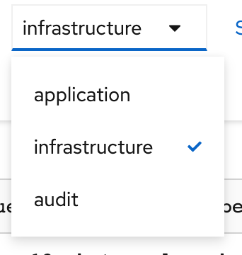
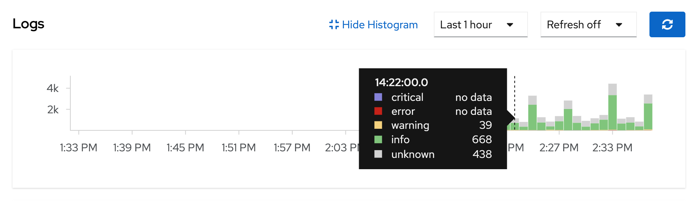

## Summary - OpenShift Logging
このラボでは、OpenShift 4.16 のロギング機能を探ります。このモジュールでは、4.16 内の新しいロギング機能をすべて分解します。

OpenShiftの非常に重要な機能は、実行中の環境とアプリケーションポッドからログを収集し、集約することです。

クラスタロギングコンポーネントは、VectorとLokiに基づいています。Vectorは高性能な観測可能データパイプラインで、Openshiftのログを異なるログコレクターに転送する log forwarders を設定できます。 Lokiは、（Prometheusのラベルのように）ラベルでログのメタデータのみをインデックス化するというアイデアに基づいて構築されたログストレージです。ログデータ自体は圧縮され、オブジェクトストア、あるいはファイルシステム上のローカルにチャンクで保存されます。

[Note]
====
詳細は公式サイトをご覧ください。
link:https://docs.openshift.com/container-platform/4.16/logging/cluster-logging.html[OpenShift
documentation site]
====

[Note]
====
演習は、ほとんどOpenShiftのWebコンソールを使って行います。Webコンソールとのやりとりはすべて、バックグラウンドでAPIオブジェクトを作成したり操作したりすることになります。コマンドラインインターフェイス (CLI) や他のツールを使用して、プロセスを完全に自動化したり、同じ結果を得ることは可能ですが、これらの方法は現時点では演習やドキュメントでカバーされていません。
====

### OpenShift Logging のデプロイ

OpenShift Container Platform クラスターロギングは、小規模から中規模の OpenShift Container Platform クラスター向けに調整されたデフォルトの構成で使用するように設計されています。この後に続くインストール手順には、クラスターロギングのカスタムリソース (CR) のサンプルが含まれており、これを使用してクラスターロギングのインスタンスを作成し、クラスターロギングのデプロイメントを構成することができます。

デフォルトのクラスター ロギング インストールを使用する場合は、サンプル CR を直接使用できます。ただし、デプロイメントをカスタマイズする場合は、必要に応じてサンプル CR に変更を加えます。

以下では、クラスター ロギング インスタンスのインストール時に実行できる構成、またはインストール後に変更できる構成について説明します。クラスター ロギング カスタム リソースの外部で実行できる変更など、各コンポーネントの操作の詳細については、構成セクションを参照してください。

[Warning]
====
重要: このワークショップ専用の kubeadmin 認証情報を使用して外部 OpenShift コンソールを設定しました。アクセスするには、ワークショップ認証情報ページを参照してください。このダッシュボード内でサービス アカウントでログインしている間は、showroomにある内部 OpenShift コンソールを使用しないでください。
====

メトリクス・サービス・ディスカバリーを有効にするには、以下のネームスペースにラベルを追加します。

openshift.io/cluster-monitoring: "true"
 
ネームスペースは、yaml形式で次のようになります。

[source,yaml]
.openshift_logging_namespace.yaml

----
apiVersion: v1
kind: Namespace
metadata:
  name: openshift-logging
  annotations:
    openshift.io/node-selector: ""
  labels:
    openshift.io/cluster-logging: "true"
    openshift.io/cluster-monitoring: "true"
----

上記の YAML で 'openshift_logging_namespace.yaml' というファイルを作成してあります。
そのファイルを使用して、以下のコマンドを実行してネームスペースを作成します。

[source,bash,role="execute"]
----
oc create -f {{ HOME_PATH }}/support/openshift_logging_namespace.yaml
----

次に、このコマンドでネームスペースが作成されたことを確認します。

[source,bash,role="execute"]
----
oc get namespace openshift-logging
----

次のように出力されます。

```
NAME                STATUS   AGE
openshift-logging   Active   11s
```

#### `Loki` と `Cluster Logging` Operators のインストール

ロギングスタックをクラスタにインストールして設定するには、追加のオペレータをインストールする必要があります。以下では、GUIを介してクラスタ内の `Operator Hub` からこれらをインストールする方法を説明します。

OpenShiftでオペレータを使用する場合、まず、オペレータを構成するいくつかの基本原理を理解することが重要です。
`CustomResourceDefinion (CRD)` と `CustomResource (CR)` は2つの Kubernetes オブジェクトです。 `CRD` は一般的な事前定義されたデータ構造です。オペレータは `CRD` で定義されたデータをどのように適用するかを理解します。プログラミングの観点では、`CRD` はクラスに似ていると考えることができます。`CustomResource (CR)` は `CRD` の実際の実装であり、構造化されたデータは実際の値を持ちます。これらの値は、サービスを構成するときにオペレータが使用するものです。繰り返しますが、プログラミングの用語では、`CR` はクラスのインスタンス化されたオブジェクトに似ています。

オペレータを使用する一般的なパターンは、まずオペレータをインストールして、必要な `CRD` を作成することです。`CRD` が作成されたら、オペレータにどのように動作するか、何をインストールするか、何を設定するかを指示する `CR` を作成することができます。`openshift-logging` をインストールする場合、このパターンに従います。

まず、以下のリンクから `OpenShiftクラスターGUI` にログインしてください。(注意: このshowroom内蔵のコンソールを使用しないでください)
`{{ MASTER_URL }}`

`All-Clusters` から `local-cluster` に切り替える必要があるかもしれません。


次の手順に従います：

1. `Cluster Logging Operator` のインストール:
+
[Note]
====
`Cluster Logging` オペレータは `openshift-logging` ネームスペースにインストールする必要があります。前の手順で `openshift-logging` ネームスペースが作成されたことを確認できます。
====

  a. OpenShift コンソールで、`Operators` → `OperatorHub` をクリックします。
  b. 検索フィールドに `OpenShift Logging` とタイプし、可能なオペレータのリストから `Red Hat OpenShift Logging` のカードをクリックします。その際、Channel `stable-5.9` を選択してください。`stable-6.0` は選択しないでください。そして `Install` をクリックします。
  c. `Install Operator` ページで、*Update Channel `stable 5.9` と `Version 5.9.7`* を選択します。 `Installation Mode` で `A specific namespace on the cluster` が選択されており、`Installed Namespace` は `Operator recommended Namespace: openshift-logging` です。他はデフォルトのままで `Install` をクリックします。

2. `Loki Operator` のインストール:
  a. OpenShift コンソールで、`Operators` → `OperatorHub` をクリックします。
  b. 検索フィールドに `Loki Operator` とタイプし、可能なオペレータのリストから `Loki Operator` のカードをクリックします。その際、Channel `stable-5.9` と Version `5.9.7` を選択してください。`stable-6.0` は選択しないでください。そして `Install` をクリックします。
  c. `Create Operator Subscription` ページで、  *Update Channel `stable-5.9`* を選択します。また、`'Enable Operator recommended cluster monitoring on this Namespace'` を選択します、他はデフォルトのままで `Install` をクリックします。
+
これにより、このOpenShift Container Platformクラスタを使用するすべてのユーザーとプロジェクトがOperatorを利用できるようになります。


3. オペレーターのインストールの確認:

  a. `Operators` → `Installed Operators` ページにスイッチします。

  b. `openshift-logging` プロジェクトが選択されていることを確かめます。

  c. _Status_ カラムが `InstallSucceeded` または `Copied` いずれかで緑のチェックになっており、下に _Up to date_ と表示されていることを確認します。
+
[Note]
====
インストール中、オペレーターが「Failed」と表示することがあります。その後、オペレータが `InstallSucceeded` というメッセージを表示してインストールされた場合、 `Failed` というメッセージは無視しても問題ありません。
====

4. トラブルシューティング (オプション/必要があれば)
+
どちらかのオペレーターがインストールされていないと表示された場合は、以下の手順に従ってトラブルシューティングを行ってください。
+
* `Installed Operators` ページのタブで、オペレータが `Copied` のステータスを表示している場合、これはインストールが進行中であることを示します。予想される動作です。
+
* `Catalog` → `Operator Management` ページに切り替えて、`Operator
  Subscriptions` と `Install Plans` タブの Status に障害やエラーがないか確認してください。
+
* `Workloads` → `Pods` ページに切り替えて、問題を報告している `openshift-logging` プロジェクトと `openshift-operators` プロジェクトの Pods のログを確認してください。
  
#### AWSでbucketを設定する
  
1. `AWS credentials` を受け取っているはずです。これらの認証情報は次の数ステップで使用する必要があります。
    
2. まず `'aws configure'` コマンドを使って `s3 (storage) bucket` を設定します。
+
[source,bash,role="execute"]
----
aws configure
----
`AWS Access Key ID` と `AWS Secret Access Key` を記入してください。
regionには `us-east-1` を、デフォルトの出力には `json` を使用します。
以下はその例です：
+
 AWS Access Key ID [None]: w3EDfSERUiLSAEXAMPLE (置き換えてください)
 AWS Secret Access Key [None]: mshdyShDTYKWEywajsqpshdREXAMPLE (置き換えてください)
 Default region name [None]: us-east-1
 Default output format [None]: json
 
3. aws フォルダの `contents` を確認します。

[source,bash,role="execute"]
----
ls .aws
----
`'config'` と `'credentials'` の2つのフォルダが見えるはずです。これが `s3 bucket config` を置く場所になります。

[start=4]
4. インスタンスが成功し、情報が正しいことを確認します。

[source,bash,role="execute"]
----
cat .aws/credentials 
----

すべての情報が正しく、あなたの設定と一致していることが確認できるはずです。
以下は出力例です：

----
[default]
aws_access_key_id = w3EDfSERUiLSAEXAMPLE
aws_secret_access_key = mshdyShDTYKWEywajsqpshdNSUWJDA+1+REXAMPLE
----

[start=5]
5. 次に、bucketに提供された情報を使ってbucketを作成します。 bucketの名前は何でもかまいません。 好きな名前をつけてください。後でわかるような名前を選んでください。
ここでは、コンソールの `GUID` である pg2nw としました。
   
`GUID` を `bucket名` として使いたい場合は、以下のようにしてください：

エクスポートするには、次のコマンドを実行します。

[source,bash,role="execute"]
export GUID=`hostname | cut -d. -f2`

GUIDを見るためには、次のコマンドを実行します。

[source,bash,role="execute"]
echo $GUID

このコマンドの出力が、bucket名です。

次に、以下のコマンドを実行して、bucketを作成します。その際、<pg2nw> の部分は自分の `GUID` に置き換えます。
 
[source,bash,role="execute"]
aws --profile default s3api create-bucket --bucket <pg2nw> --region us-east-1 

これは先程設定した `default` という `profile` から `aws bucket` を作成しているところです。
この後、使用するので、bucket名を覚えておいてください。

bucket名を一般的なものにしすぎるとエラーが出るかもしれません。このような `error` が表示されたら、別の名前にしてみてください：
----
An error occurred (BucketAlreadyExists) when calling 
the CreateBucket operation: The requested bucket name 
is not available. The bucket namespace is shared by 
all users of the system. Please select a different 
name and try again.
----

次のように見えれば成功です。

----
{
    "Location": "/pg2nw"
}
----
 
#### Openshiftでシークレットを作成する
  
次にシークレットを設定する必要があります。この `secret` には先ほど作成した `s3 bucket` のアクセス認証情報を格納します。これは後で `LokiStack` が `logging data` を保存するために使用することになります。
  
  a. コンソールに移動し、`Workloads` -> `Secrets` をクリックします。
  
  b. 次に、`Create` を選択し `from YAML` にします。
  
  c. 現在のYAMLを削除し、このYAMLに置き換えます（AWS credsがマッチしていることを確認してください）
  
[source,yaml]

----
apiVersion: v1
kind: Secret
metadata:
  name: lokistack-dev-s3
  namespace: openshift-logging
stringData:
  access_key_id: w3EDfSERUiLSAEXAMPLE (自分のaws credsに置き換える)
  access_key_secret: mshdyShDTYKWEywajsqpshdNSUWJDA+1+REXAMPLE (自分のaws credsに置き換える)
  bucketnames: 自分のbucket名に置き換える (この例では pg2nw)
  endpoint: https://s3.us-east-1.amazonaws.com/
  region: us-east-1
----

[start=4]
4. 問題がなければ、`Create` をクリックします。
  
5. 以下のコマンドを実行して、`lokistack-dev-s3 secret` が作成されていることを確認します。

[source,bash,role="execute"]
kubectl get secrets -n openshift-logging
 
このように表示されるはずです:

```
NAME                                       TYPE                      DATA   AGE
builder-dockercfg-vppmj                    kubernetes.io/dockercfg   1      10m
cluster-logging-operator-dockercfg-bc7nd   kubernetes.io/dockercfg   1      4m58s
cluster-logging-operator-dockercfg-rr9kb   kubernetes.io/dockercfg   1      5m2s
default-dockercfg-rtkcq                    kubernetes.io/dockercfg   1      10m
deployer-dockercfg-t6pjc                   kubernetes.io/dockercfg   1      10m
lokistack-dev-s3                           Opaque                    5      5s
```

#### LokiStackの作成
  
1.コンソールで `Operators` -> `Installed Operators` を選択します。
  
  a. `Loki Operator` を選択します。
  
  b. 最初のページの `Provided APIs` と `LokiStack` の下で `Create instance` を選択します。
  
  c. `YAML view` オプションにスイッチします。
  
  d. 現在のYAMLを削除し、このYAMLに置き換えます。
  
[source,yaml]

----
apiVersion: loki.grafana.com/v1
kind: LokiStack
metadata:
  name: lokistack-dev
  namespace: openshift-logging
spec:
  size: 1x.extra-small
  storage:
    schemas:
    - version: v13
      effectiveDate: "2022-06-01"
    secret:
      name: lokistack-dev-s3
      type: s3
  storageClassName: gp2-csi
  tenants:
    mode: openshift-logging
----

この YAML は使用可能な `LokiStack` を作成します。この `YAML` を見てわかるように、先ほど作成したシークレットファイルを使います。

d. `Create` をクリックします。

e. `LokiStack` タブに移動し、`lokistack-dev` をクリックします。

起動に1分ほどかかるかもしれませんが、最終的にはこのようになるはずです。

image::images/LokiStack.png[]

_Figure 1: LokiStack +

ルーラーを設定していないので、`The field components.ruler is invalid.` と表示されるはずです。

#### Logging `CustomResource (CR)` インスタンスの作成

これでほぼすべてのセットアップが完了したので、Loggingの `CustomResource (CR)` インスタンスを作成する必要があります。

1. コンソールで `Operators` ->  `Installed Operators` を選択します。
2. `Red Hat OpenShift Logging` を選択します。
3. 最初のページの `Provided APIs` と `LokiStack` の下で `Create instance` を選択します。
4. 現在のYAMLを削除し、このYAMLに置き換えます。
  
[source,yaml]

----
apiVersion: logging.openshift.io/v1
kind: ClusterLogging
metadata:
  name: instance
  namespace: openshift-logging
spec:
  logStore:
    type: lokistack
    lokistack:
      name: lokistack-dev
  collection:
    logs:
      type: vector
----

これはネームスペース `openshift-logging` 内に、`Cluster logging` のインスタンスを作成します。
ログは `LokiStack` に保存され、保存されるログの型は `vector` です。

[start=5]
5. 最後に、`Create` をクリックします。

#### Logging　インストールの確認

Logging が作成されたので、機能していることを確認しましょう。

1. `Workloads` → `Pods` ページにスイッチします。

2. `openshift-logging` プロジェクトを選択します。

`cluster logging` 用のpodがあることがわかります(オペレーターそのもの)。
`collectors`, `logging-view-plugin`, `lokistack` の様々なpodです。

あるいは、以下のコマンドを使ってコマンドラインから検証することもできます。

[source,bash,role="execute"]
----
oc get pods -n openshift-logging
----

最終的にはこのように表示さ れます。

----
cluster-logging-operator-6d94c695db-lpjgd       1/1     Running   0          89m
collector-5z8ll                                 2/2     Running   0          80m
collector-bdjnv                                 2/2     Running   0          79m
collector-bwxdr                                 2/2     Running   0          79m
collector-m75c7                                 2/2     Running   0          80m
collector-snqp5                                 2/2     Running   0          80m
collector-spdr2                                 2/2     Running   0          79m
logging-view-plugin-69c86cb9c9-4qlcj            1/1     Running   0          80m
lokistack-dev-compactor-0                       1/1     Running   0          81m
lokistack-dev-distributor-56cf98db97-vvpbw      1/1     Running   0          81m
lokistack-dev-gateway-757dd67c8c-gv9s5          2/2     Running   0          81m
lokistack-dev-gateway-757dd67c8c-rcfb2          2/2     Running   0          81m
lokistack-dev-index-gateway-0                   1/1     Running   0          81m
lokistack-dev-ingester-0                        1/1     Running   0          81m
lokistack-dev-querier-5854c87fcb-hqltx          1/1     Running   0          81m
lokistack-dev-query-frontend-855b5684f7-846vb   1/1     Running   0          81m
----

約30秒から1分後、右上にボックスがポップアップ表示されます。
`"Web console update is available"` と表示され、ブラウザを更新するよう促されますので実行します。
これでログにアクセスできるようになります。

もし、Fluentdのステータスに言及されているのを見かけたら、現在のタスクとは関係ないので、無視してください。

image::images/Loki_refresh.png[]

#### ログを観察する

1. 左側のメニューにある `Observe` から `Logs` に行くことができます。

2. 中に入ると、現在 `Applications` に設定されているメニューに気づくでしょう、これを `infrastructure` に変更してください。

これで、`Infrastructure` のすべての `logs` が表示されるはずです。ログは 3つのセクションに分かれています。`application`, `infrastructure` と `audits` です。`audits` と `log forwarder` のセットアップは次のパートで行いますが、様々な部分を見てみましょう。



下の図にあるように、`Content`、 `Namespaces`、 `Pods`、 `Containers` でフィルタリングすることができます。
これは、より具体的なものを探すときに検索を絞り込むのに便利です。

image::images/filterlogs.png[]

`Severity` の別のドロップダウン メニューを使用して、探しているログをさらに指定できます。このメニューでは、ログが `critical`、
`error`、`warning`、`debug`、`info`、`trace`、および `unknown` のログ カテゴリに分類されます。

image::images/severity.png[]

最後の部分は `histogram` です。これにより、ユーザーはログをより視覚的に確認できます。(入力には少し時間がかかる場合があります)




#### Log forwarding のセットアップ

`audit logs` にアクセスするには、`log forwarder` を設定する必要があります。まず、`collectors` に `audit logs` をクラスター経由で転送するように指示します。

1. 左のナビゲーションバーを使用して `Operators` -> `Installed Operators` にアクセスします。
2. `Red Hat OpenShift Logging` を選択します。
3. `Provided APIs` と `Cluster Log Forwarder` の下に `Create instance` というボタンがありますので、それを選択します。

現在表示されているYAMLを削除し、新しいYAMLに置き換えます。

[source,yaml]

----
apiVersion: logging.openshift.io/v1
kind: ClusterLogForwarder
metadata:
  name: instance
  namespace: openshift-logging
spec:
  pipelines:
  - name: all-to-default
    inputRefs:
    - infrastructure
    - application
    - audit
    outputRefs:
    - default

----
[start=4]

4. 次に `create` をクリックします。

[start=5]
5. これで、`Observe` -> `Logs` に戻ると、メニューから `Audit` を選択できるようになります。

#### Congratulations, これでロギングセクションは完了です。

